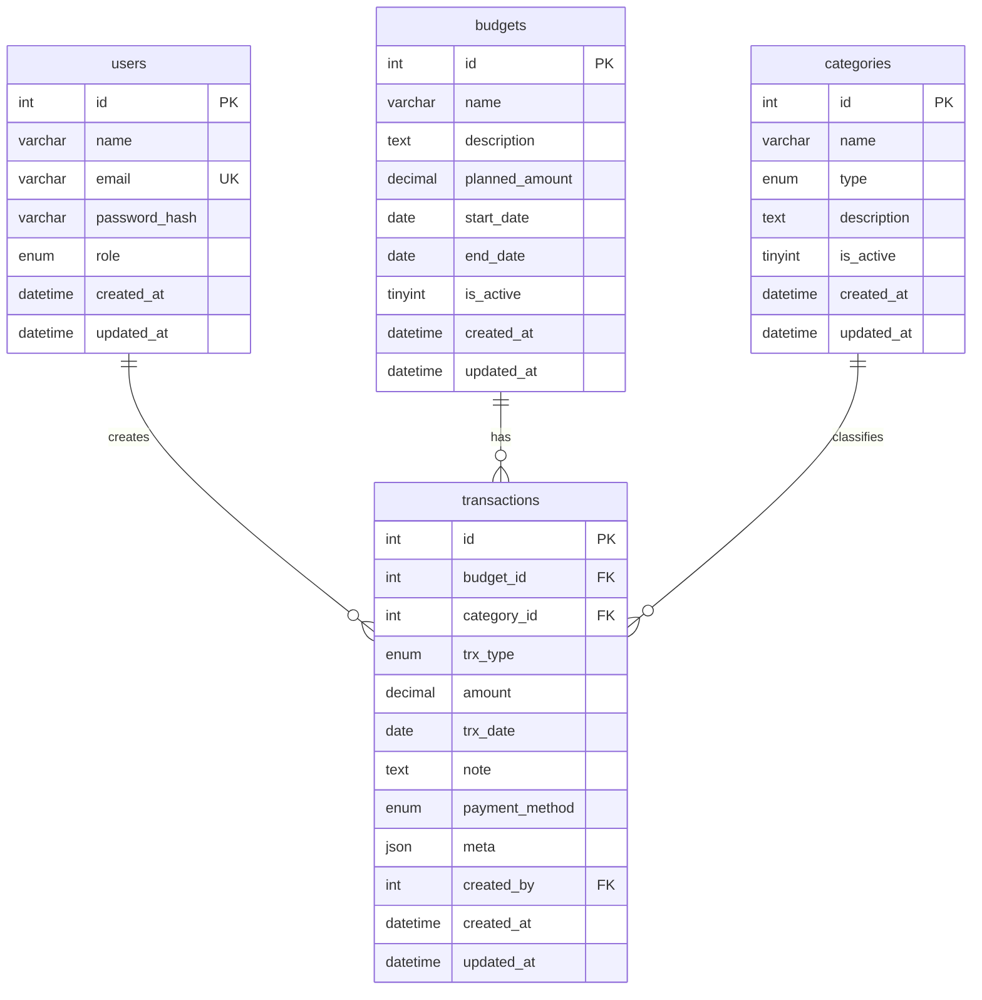

# Database Design - Kas Organisasi

## ERD (Entity Relationship Diagram)

## Penjelasan Relasi

1. **users ↔ transactions** (1:N)
   - Satu user dapat membuat banyak transactions (relasi opsional via created_by)
   - Relasi: `transactions.created_by` → `users.id`

2. **budgets ↔ transactions** (1:N) ⭐ RELASI WAJIB
   - Satu budget (anggaran) dapat memiliki banyak transactions
   - Setiap transaction harus terikat ke satu budget
   - Relasi: `transactions.budget_id` → `budgets.id`
   - Foreign Key: RESTRICT (tidak boleh hapus budget yang masih punya transaksi)

3. **categories ↔ transactions** (1:N) ⭐ RELASI WAJIB
   - Satu category dapat dimiliki banyak transactions
   - Setiap transaction harus memiliki category
   - Relasi: `transactions.category_id` → `categories.id`
   - Foreign Key: RESTRICT (tidak boleh hapus category yang masih digunakan)

## Kolom Khusus

### Kolom Angka (Numeric):
- `budgets.planned_amount` - DECIMAL(12,2): Total anggaran yang direncanakan
- `transactions.amount` - DECIMAL(12,2): Jumlah uang income/expense

### Kolom Tanggal (Date/DateTime):
- `budgets.start_date` - DATE: Tanggal mulai periode anggaran
- `budgets.end_date` - DATE: Tanggal akhir periode anggaran
- `transactions.trx_date` - DATE: Tanggal transaksi terjadi
- Semua tabel: `created_at`, `updated_at` - DATETIME: Audit trail

### Kolom JSON (NoSQL-like):
- `transactions.meta` - JSON: Data fleksibel (contoh: {receipt_url, pic_name, location, notes_detail})

## Business Rules

1. **Budgets**:
   - `planned_amount` >= 0
   - `start_date` <= `end_date`
   - `name` harus unique per aktif budget

2. **Categories**:
   - `type` menentukan transaksi yang bisa menggunakan category ini
   - `income`: hanya untuk transaction type income
   - `expense`: hanya untuk transaction type expense
   - `both`: bisa untuk income dan expense

3. **Transactions**:
   - `amount` > 0
   - `trx_type` harus match dengan `category.type`
   - `budget_id` harus valid (exist di tabel budgets)
   - `category_id` harus valid (exist di tabel categories)
   - `meta` harus JSON valid jika diisi
